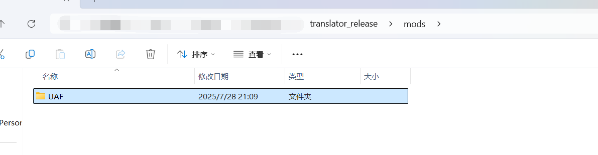
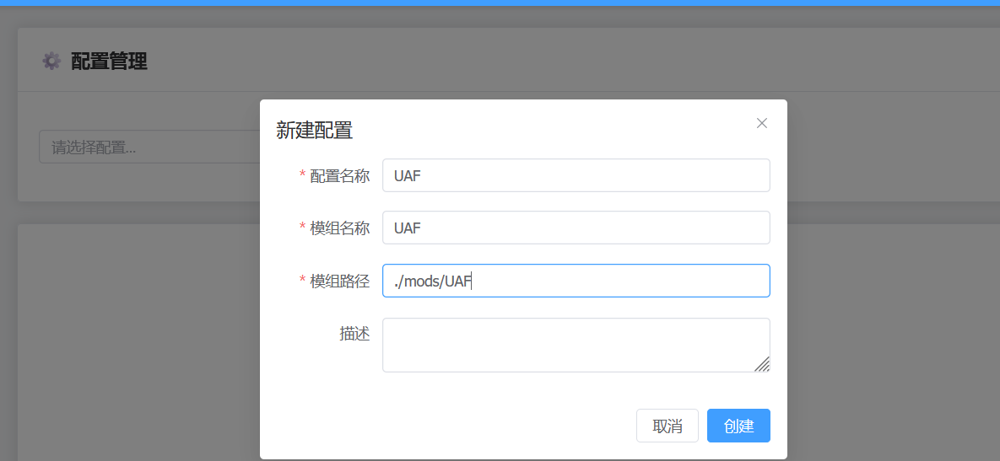
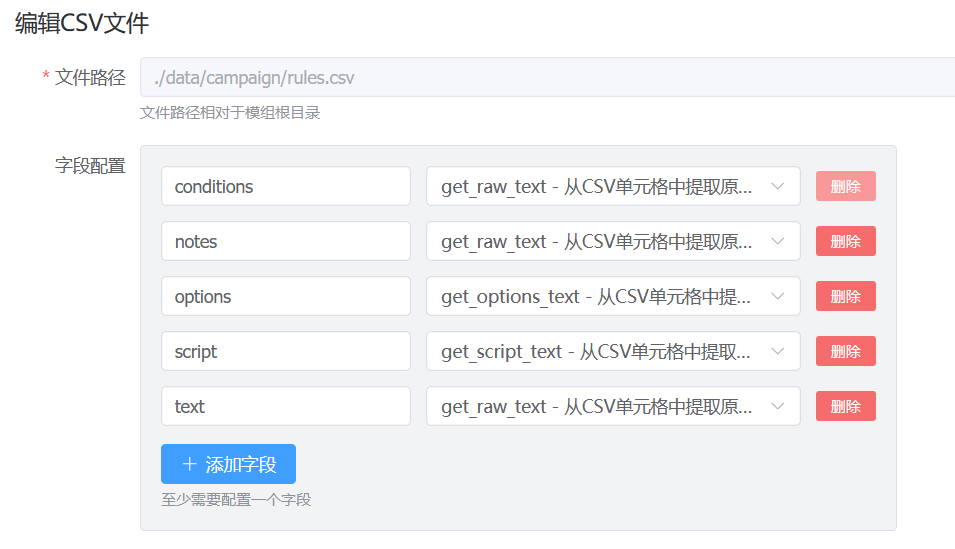
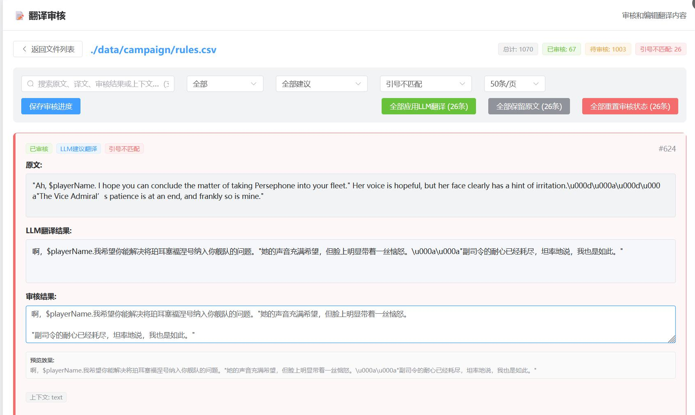
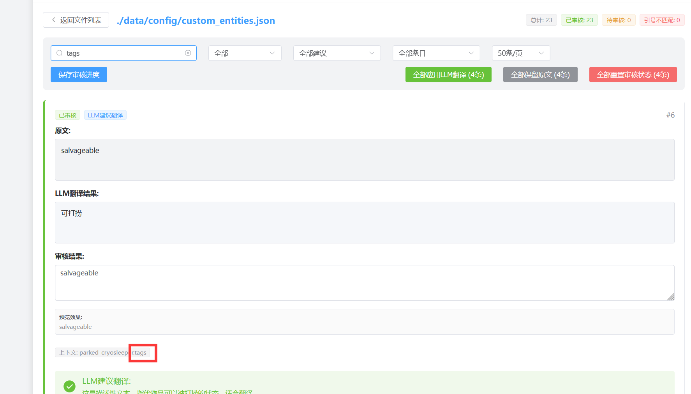
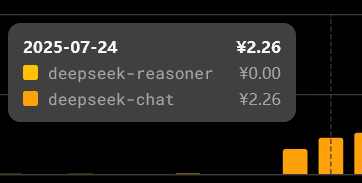

# Starsector 集成翻译工具

## 简介
本工具是为游戏 **远行星号** 制作的集成翻译工具。

## 主要功能
- **文本提取**：从 csv、json、jar 文件中提取翻译所需的文本。
- **LLM 翻译**：将文本提交至 LLM 进行翻译，需要用户拥有 LLM 服务 API KEY。
- **翻译审核**：提供用户对 LLM 翻译进行审核的页面。
- **汉化打包**：应用翻译并生成汉化补丁。
- **翻译记忆及专有名词管理**：根据历史翻译和用户设置的专有名词构建 prompt，增强 LLM 翻译一致性，减少 LLM 调用。

---

## 快速开始

### 有一定编程基础的用户
1. 将本项目克隆至本地。
2. 使用 **Python 3.10** 及以上版本。
3. 安装依赖：
   ```bash
   pip install -r requirements.txt
   ```
4. 构建前端:
   ```bash
   cd frontend && npm run build && cd ..
   ```
5. 运行程序：
   ```bash
   python web_ui.py
   ```

### 一般用户
- 下载打包好的可执行文件，双击运行。

服务启动后，打开浏览器并访问：
```
http://localhost:5000
```

---

## 详细使用流程

1. **获取 LLM API KEY**
   - 推荐 deepseek，prompt 调试基于 deepseek。
2. **配置 API**
   - 在配置管理中，点击“配置 API 设置”，设置你的 API 密钥。
   - 如果是 deepseek，其他全局设置可默认。
   - 非 deepseek 需根据 LLM 文档设置模型、TOKEN（deepseek 为 8000）。
   - 设置完毕后保存。
3. **准备模组**
   - 将需要翻译的模组复制到本服务同目录下。
   - 例如 UAF 模组，目录结构如下：

     

4. **新建配置**
   - 配置名和模组名自定义，配置名建议不用中文。
   - 填写模组的相对路径。

     

5. **自动配置**
   - 服务会扫描模组路径生成基本配置文件。
   - csv、json 文件需人工复查是否有不需要翻译或漏翻字段，可手动编辑配置。
   - 例如 rules.csv 的 condition 字段不需翻译，可在配置中删除。

6. **文本提取方法说明**
   - csv 有 4 种文本提取方法，可按需使用。

     

   - 大部分 csv 字段用 get_raw_text，option 和 script 字段用专门处理函数，rules.csv 的 text 字段有 OR 分割情况，也有专门提取函数。
   - json 只提取叶子节点，由程序判断是否需翻译，审核阶段需检查。
   - jar 文件一般只有一种文本提取方法，最终确认在审核阶段。

7. **开始翻译**
   - 配置无误后，在文件列表中点击“开始翻译”，等待 LLM 翻译完成。
   - 为提高一致性，本项目不会并发调用 LLM API，翻译耗时较长，可后台运行。

8. **翻译审核**
   - 文件翻译完成后，可在“翻译审核”页面人工确认。
   - 直接填写审核结果即通过审核，可随时重置。
   - “全部应用 LLM 翻译”和“全部保留原文”仅对当前过滤结果生效。

#### 审核小 Tips
- LLM 翻译大多可靠，服务也对占位符号做了严格检查, 非单词原文一般可以直接通过。
- csv 文件要严格检查引号不匹配，LLM有一定概率返回的译文缺失引号, 而引号在csv文件里可作为控制符号, 缺失引号会导致游戏无法启动. 服务提供过滤选项, 帮助你快速定位引号缺失的译文并进行处理.

  

- LLM 会给出翻译建议，LLM的建议比较保守, LLM建议不翻译的内容一般真的不能翻译, 可全部保留原文。
- “单词原文”过滤项适用于 json 和 jar 文件，最保守的策略是全部不翻译, 因为它们很有可能是变量。
- 审核页面可根据“上下文”判断是否需翻译：
  - 上下文含 "id"、"tag" 的一般不翻译，含 "text" 的可翻译。
  - 搜索栏支持上下文字段搜索。

  

- 全部审核完毕后，点击“应用翻译”，再点击“导出汉化包”生成压缩包

---

## 专有名词功能
可配置专有名词，程序会在翻译时检索并作为 prompt 一部分提交给 LLM，提高专有名词翻译准确性。

## 翻译记忆功能
记录所有历史翻译，遇到相同文本直接采用历史翻译，减少 LLM 调用。也会搜索相似历史翻译，增强一致性。同时, 你也可以借助这个功能搜索特定的原文/译文, 以快速定位漏译和错译.

---

## FAQ

- **Q: 翻译一个模组要花费多少钱？**
  - A: 视模组文本规模和 LLM 收费情况而定。参考：用 deepseek 翻译 UAF 模组约 2 元人民币。

    

- **Q: 应用汉化包后游戏崩溃**
  - A: 你需要根据starsector.log进行排查, 看看是载入什么文件报错, 然后人工排查, 一般是翻译了不该翻译的文本, 本工具是辅助程序, 无法做到一键完美汉化

- **Q: 我使用这个工具做的汉化包可以公开发布吗？**
  - A: 本工具不限制/负责汉化包发布，汉化发布需遵循各社区约定（原作者同意, 保证质量等）。本工具不为翻译质量及其后的任何争议负责

- **Q: 我可以对这个工具进行二次开发吗？**
  - A: 可以，遵循 GPL 协议，二次开发需保持开源和免费。

---

如有问题欢迎反馈、交流。如果觉得本工具对你有帮助, 不妨点下右上角的star